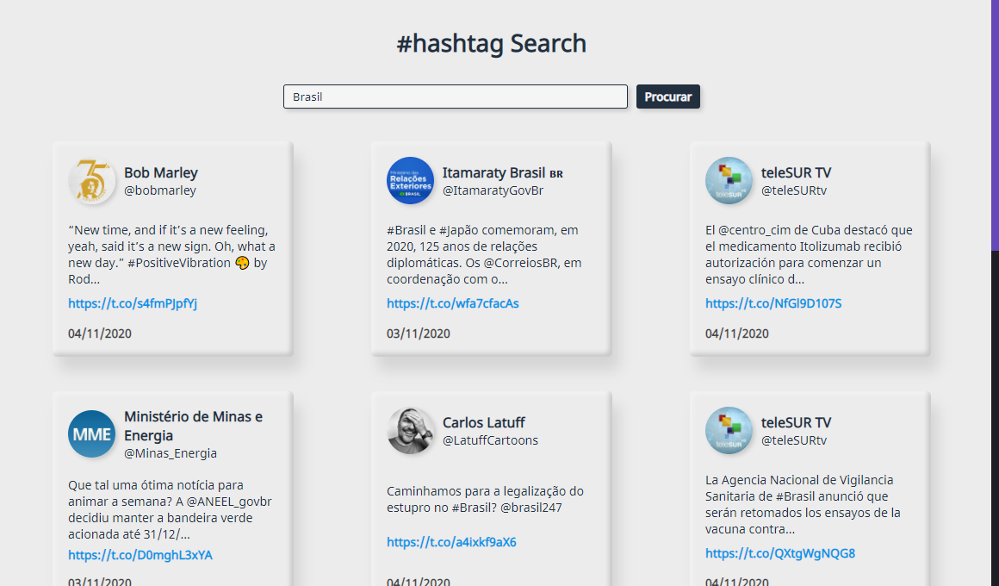

# Projetos para Desenvolvedor Front-end - LINX

## Informações sobre os projetos:

Estes projetos são feitos exclusivamente para a resolução de 2 desafios técnicos propostos pela empresa LINX para a vaga de Desenvolvedor JS.

> Observação: Não foi realizado testes unitários como solicitado no desafio pela questão do prazo, visto que eles acabam demorando um pouco mais para garantir a qualidade. Mas eles não seriam problemas, visto que, atualmente, como QA, já tenho conhecimento de testes automatizados E2E e unitários em React.js; 

## Projeto 1: #hashtag Search Twitter :bird:

Uma aplicação desenvolvida em React.js, com um back-end em Node com Express, para realizar buscas na API do Twitter usando como parâmetro as hashtags;

Esta aplicação teve uma dificuldade maior pela questão da implementação do back-end, visto que, na documentação da API, pede que sejam feitas as requisições por um servidor. Tentei realizar as requisições diretamente da aplicação utilizando Axios, porém, não houve sucesso. Talvez, daria para tentar utilizando outros métodos, mas achei mais simples criar um 'mini-servidor' para isto.
  

## Projeto 2: Álbuns Imgur 📷

Outra aplicação também desenvolvida com React.js, porém, sem a necessidade de um back-end. Esta aplicação faz o upload de imagens com a API do Imgur e também cria álbuns com estas imagens enviadas.

Utilizado Bootstrap para acelerar a produção de estilos padrões.

  

## Como executar localmente:

Será necessário clonar este repositório e, acessando a pasta de cada um deles, irá ter maiores informações sobre quais comandos executar.

Em qualquer um deles, é necessário ter o **Node** e o **NPM** instalados na máquina.

